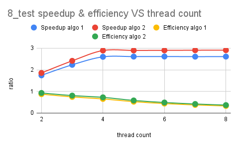

# TP1 - pthread 

Equipe 1 :
- Vincent Commin
- Louis Leenart

# Enoncé

Pour ce TP, nous avons dû paralléliser la recherche de nombres premiers dans plusieurs intervalles. Pour ce faire, nous avons utilisé l'algorithme de [Miller-Rabin](https://fr.wikipedia.org/wiki/Test_de_primalit%C3%A9_de_Miller-Rabin) disponible [ici](https://github.com/cslarsen/miller-rabin) (nous avons récupéré les fichiers `miller-rabin-gmp.hpp` et `miller-rabin-gmp.cpp` et les avons utilisé tel quel moyennant quelques changements que nous expliquerons plus tard). Le fait d'utiliser la version gmp (nommé d'après la bibliothèque `gmp`) nous permet d'exécuter la recherche de nombres premiers sur des nombres codés sur plus de 64 bits.

# Notre approche

Pour paralléliser le programme nous avons testé deux approches différentes :

1. Chaque thread prend le nombre à traiter dans l'intervalle dès que celui-ci à fini de calculer le nombre précédent.
2. Chaque thread à un intervalle qui lui est attribué (pertinent pour les fichiers avec beaucoup d'intervalles mais pas pour un fichier avec 2 ou 3 intervalles).

## Modification du code de l'implémentation de Miller Rabin par Christian Stigen Larsen

Pour déterminer si un nombre est premier, nous utilisons l'algorithme de [Miller Rabin](https://fr.wikipedia.org/wiki/Test_de_primalit%C3%A9_de_Miller-Rabin), et afin de nous concentrer sur la parallélisation du calcul, nous avons décidé d'utiliser l'implémentation de Christian Stigen Larsen disponible sur [Github](https://github.com/cslarsen/miller-rabin) qui supporte l'algorithme pour les grands nombres (via la librairie [GMP](https://gmplib.org/)). 

L'implémentation proposée ne supporte pas le multithreading, notamment avec l'utilisation d'une varaible globale pour accéder à un nombre premier (`static gmp_randclass *prng` dans le code initial). Si plusieurs threads venaient à initialiser cette ressource en même temps, nous ferions face à un comportement indéfini. Nous avons donc modifié le code pour que chaque thread puisse accéder à cette ressource. Maintenant, les fonctions qui lancent les threads (`compute_prime` et `compute_prime_improved`) s'occupent de l'initialisation de la ressource (qui est de type `gmp_randclass`) et de donner l'accès aux threads. Aussi, d'après la documentation de [GMP](https://gmplib.org/gmp-man-6.2.1.pdf), l'utilisation de cet objet est thread-safe.

Aussi, l'implémentation de Christian Stigen Larsen de $a^x \mod n$ suivait une implémentation faite par ce dernier, cependant une fonction de la librairie GMP propose déjà une implémentation qui est bien plus performante.

## Algorithme 1

Le premier algorithme de parallélisation, `compute_prime`, consiste à lancer, pour chaque intervale de nombre à traiter, les $n$ thread. Les threads vont prendre chacun leur tour un nombre à traiter dans une pile (contenant tous les nombres de l'interval), appliquer l'algorithme de Miller Rabin sur ce dernier, et recommencer jusqu'à ce qu'il n'y ait plus de nombre à traiter. Cette opération est ensuite répétée pour chaque interval. Le pseudo code est le suivant : 

```
mutex_a_traiter         : mutex // pour la récupération du nombre à traiter
mutex_nombre_premiers   : mutex // pour l'ajout d'un nombre premier dans le vecteur des nombres premiers

STRUCTURE arguments_thread
    nombres_premiers : vecteur de grands nombres (mpz_class)
    aleatoire       : (gmp_randclass) // permet de créer de grands nombres aléatoires, nécessaire pour l'algorithme implémenté de Miller-Rabin
    tour            : entier // Nombre d'itérations pour Miller-Rabin
    a_traiter       : grand nombre (mpz_class) // nombre suivant à traiter pour le thread 
    max             : grand nombre (mpz_class) // borne max de l'intervalle
FIN STRUCTURE

thread(args : pointeur vers arguments_thread)
    thread_nombre_premier : vecteur de grands nombres
    TANT QUE Vrai FAIRE 
        PRENDRE mutex_a_traiter
        
        SI (args.a_traiter >= args.max) ALORS // Si il n'y a plus de valeur à traiter
            RENDRE mutex_a_traiter            // Terminer le thread
            QUITTER thread
        FIN SI

        a_traiter : grand nombre = args.a_traiter
        INCREMENTER args.a_traiter

        RENDRE mutex_a_traiter

        est_premier : booléen = calculer_premier(a_traiter, args.tour, args.aleatoire)

        SI (est_premier) ALORS
            AJOUTER a_traiter DANS thread_nombres_premiers
        FIN SI
    FIN TANT QUE 

    SI (TAILLE thread_nombres_premiers > 0) ALORS
        PRENDRE mutex_nombre_premiers
        FUSIONNER thread_nombres_premiers DANS args.nombres_premiers
        RENDRE mutex_nombre_premiers
    FIN SI
FIN thread
```

## Algorithme 2

Après avoir implémenter le premier algorithme, nous avons rapidement remarqué un problème : la création et la destruction des threads se fait pour chaque intervalle demandé, et ce sont des opérations qui sont très coûteuses. L'algorithme semble pas très efficace pour un grand nombre de petit intervalles (voir [Résultats expérimentaux](#r%C3%A9sultats-exp%C3%A9rimentaux)). Nous avons donc trouvé une nouvelle approche, donc obtenir un algorithme qui demande moins d'appels systèmes. Ce nouvel algorithme se contente de créer $n$ threads, et ces derniers traitent un intervalle chacun. Dès qu'un thread a terminé de traiter un intervalle, il passe au suivant disponible, jusqu'à ce que tous les intervalles soient traités. Le pseudo code du thread est le suivant :

```
mutex_compteur        : mutex // pour la récupération du prochain intervalle à traiter par le thread
mutex_nombre_premiers : mutex // pour l'ajout des nombres premiers trouvés dans le vecteur des nombres premiers

STRUCTURE arguments_thread
    nombres_premiers : vecteur de grands nombres (mpz_class)
    intervalles     : vecteur de grands nombres contenant les bornes hautes et les bornes basses des intervalles du fichier à traiter 
    compteur        : index du prochain intervalle à traiter dans le vecteur d'intervalles
    tour            : entier // Nombre d'itérations pour Miller-Rabin
FIN STRUCTURE

thread(args : pointeur vers arguments_thread)
    aleatoire : (gmp_randclass)
    thread_nombre_premier : vecteur de grands nombres
    TANT QUE Vrai FAIRE 
        PRENDRE mutex_compteur
        
        // -1 correspond à "plus d'intervalles disponibles"
        SI (mutex_compteur == -1) ALORS
            RENDRE mutex_intervalles
            QUITTER TANT QUE
        FIN SI

        SI (args.intervalles[compteur + 1] n'existe pas) ALORS
            compteur = -1
            RENDRE mutex_intervalles
            QUITTER TANT QUE
        SINON
            borne_basse : grand nombre = args.intervalles[compteur]
            borne_haute : grand nombre = args.intervalles[compteur + 1]
            compteur = compteur + 2
        FIN SI

        RENDRE mutex_intervalles

        POUR i ALLANT DE borne_basse A borne_haute FAIRE
            est_premier : booléen = calculer_premier(i, args.tour, aleatoire)
            SI (est_premier) ALORS
                AJOUTER i DANS thread_nombre_premier
            FIN SI
        FIN POUR
    FIN TANT QUE 
    // Ajout des nombre premiers trouvés
    SI (TAILLE thread_nombre_premier > 0) ALORS
        PRENDRE mutex_nombre_premiers
        FUSIONNER thread_nombre_premier DANS args.nombres_premiers
        RENDRE mutex_nombre_premiers
    FIN SI
FIN thread
```

# Ordinateur utilisé pour les tests de performance

* Modèle : i7-8550U 
* Architecture : x86_64
* OS : Archlinux
* Fréquence CPU : 3.4GHz
* Coeurs physiques : 4
* Coeurs logiques : 8
* Ram : 16 Go, 2400 MT/s

# Résultats expérimentaux
<!-- Vos résultats expérimentaux avec des courbes de speedup et/ou d'efficacité -->



# Analyse des résultats
<!-- 
    Une analyse de vos résultats, y compris une discussion de vos succès ou de vos échecs; 
    Votre programme fonctionne-t-il correctement?
    Avez-vous maximisé l'indépendance de vos fils d'exécution?
    Avez-vous minimisé l'usage de mutex, lorsque c'est possible?
    Avez-vous tenu compte des contraintes de mémoire cache pour optimiser votre performance?
    Avez-vous profité des options d'optimisation du compilateur?
-->


# Conclusion
<!-- Et des pistes d'améliorations possibles -->