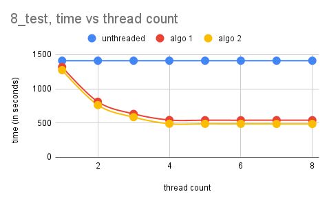

# TP1 - pthread 

Equipe 1 :
- Vincent Commin
- Louis Leenart

# Enoncé

Pour ce TP, nous avons dû paralléliser la recherche de nombres premiers dans plusieurs intervalles. Pour ce faire, nous avons utilisé l'algorithme de [Miller-Rabin](https://fr.wikipedia.org/wiki/Test_de_primalit%C3%A9_de_Miller-Rabin) disponible [ici](https://github.com/cslarsen/miller-rabin) (nous avons récupéré les fichiers `miller-rabin-gmp.hpp` et `miller-rabin-gmp.cpp` et les avons utilisé tel quel moyennant quelques changements que nous expliquerons plus tard). Le fait d'utiliser la version gmp (nommé d'après la bibliothèque `gmp`) nous permet d'exécuter la recherche de nombres premiers sur des nombres codés sur plus de 64 bits.

# Notre approche

Pour paralléliser le programme nous avons testé deux approches différentes :

1. Chaque thread prend le nombre à traiter dans l'intervalle dès que celui-ci à fini de calculer le nombre précédent.
2. Chaque thread à un intervalle qui lui est attribué (pertinent pour les fichiers avec beaucoup d'intervalles mais pas pour un fichier avec 2 ou 3 intervalles).

## Modification du code de l'implémentation de Miller Rabin par Christian Stigen Larsen

Pour déterminer si un nombre est premier, nous utilisons l'algorithme de [Miller Rabin](https://fr.wikipedia.org/wiki/Test_de_primalit%C3%A9_de_Miller-Rabin), et afin de nous concentrer sur la parallélisation du calcul, nous avons décidé d'utiliser l'implémentation de Christian Stigen Larsen disponible sur [Github](https://github.com/cslarsen/miller-rabin) qui supporte l'algorithme pour les grands nombres (via la librairie [GMP](https://gmplib.org/)). 

L'implémentation proposée ne supporte pas le multithreading, notamment avec l'utilisation d'une varaible globale pour accéder à un nombre premier (`static gmp_randclass *prng` dans le code initial). Si plusieurs threads venaient à initialiser cette ressource en même temps, nous ferions face à un comportement indéfini. Nous avons donc modifié le code pour que chaque thread puisse accéder à cette ressource. Maintenant, les fonctions qui lancent les threads (`compute_prime` et `compute_prime_improved`) s'occupent de l'initialisation de la ressource (qui est de type `gmp_randclass`) et de donner l'accès aux threads. Aussi, d'après la documentation de [GMP](https://gmplib.org/gmp-man-6.2.1.pdf), l'utilisation de cet objet est thread-safe.

Aussi, l'implémentation de Christian Stigen Larsen de $a^x \mod n$ suivait une implémentation faite par ce dernier, cependant une fonction de la librairie GMP propose déjà une implémentation qui est bien plus performante.

## Algorithme 1

Le premier algorithme de parallélisation, `compute_prime`, consiste à lancer, pour chaque intervale de nombre à traiter, les $n$ thread. Les threads vont prendre chacun leur tour un nombre à traiter dans une pile (contenant tous les nombres de l'interval), appliquer l'algorithme de Miller Rabin sur ce dernier, et recommencer jusqu'à ce qu'il n'y ait plus de nombre à traiter. Cette opération est ensuite répétée pour chaque interval. Le pseudo code est le suivant : 

```
mutex_a_traiter         : mutex // pour la récupération du nombre à traiter
mutex_nombre_premiers   : mutex // pour l'ajout d'un nombre premier dans le vecteur des nombres premiers

STRUCTURE arguments_thread
    nombres_premiers : vecteur de grands nombres (mpz_class)
    aleatoire       : (gmp_randclass) // permet de créer de grands nombres aléatoires, nécessaire pour l'algorithme implémenté de Miller-Rabin
    tour            : entier // Nombre d'itérations pour Miller-Rabin
    a_traiter       : grand nombre (mpz_class) // nombre suivant à traiter pour le thread 
    max             : grand nombre (mpz_class) // borne max de l'intervalle
FIN STRUCTURE

thread(args : pointeur vers arguments_thread)
    thread_nombre_premier : vecteur de grands nombres
    TANT QUE Vrai FAIRE 
        PRENDRE mutex_a_traiter
        
        SI (args.a_traiter >= args.max) ALORS // Si il n'y a plus de valeur à traiter
            RENDRE mutex_a_traiter            // Terminer le thread
            QUITTER thread
        FIN SI

        a_traiter : grand nombre = args.a_traiter
        INCREMENTER args.a_traiter

        RENDRE mutex_a_traiter

        est_premier : booléen = calculer_premier(a_traiter, args.tour, args.aleatoire)

        SI (est_premier) ALORS
            AJOUTER a_traiter DANS thread_nombres_premiers
        FIN SI
    FIN TANT QUE 

    SI (TAILLE thread_nombres_premiers > 0) ALORS
        PRENDRE mutex_nombre_premiers
        FUSIONNER thread_nombres_premiers DANS args.nombres_premiers
        RENDRE mutex_nombre_premiers
    FIN SI
FIN thread
```

## Algorithme 2

Après avoir implémenter le premier algorithme, nous avons rapidement remarqué un problème : la création et la destruction des threads se fait pour chaque intervalle demandé, et ce sont des opérations qui sont très coûteuses. L'algorithme semble pas très efficace pour un grand nombre de petit intervalles (voir [Résultats expérimentaux](#r%C3%A9sultats-exp%C3%A9rimentaux)). Nous avons donc trouvé une nouvelle approche, donc obtenir un algorithme qui demande moins d'appels systèmes. Ce nouvel algorithme se contente de créer $n$ threads, et ces derniers traitent un intervalle chacun. Dès qu'un thread a terminé de traiter un intervalle, il passe au suivant disponible, jusqu'à ce que tous les intervalles soient traités. Le pseudo code du thread est le suivant :

```
mutex_compteur        : mutex // pour la récupération du prochain intervalle à traiter par le thread
mutex_nombre_premiers : mutex // pour l'ajout des nombres premiers trouvés dans le vecteur des nombres premiers

STRUCTURE arguments_thread
    nombres_premiers : vecteur de grands nombres (mpz_class)
    intervalles     : vecteur de grands nombres contenant les bornes hautes et les bornes basses des intervalles du fichier à traiter 
    compteur        : index du prochain intervalle à traiter dans le vecteur d'intervalles
    tour            : entier // Nombre d'itérations pour Miller-Rabin
FIN STRUCTURE

thread(args : pointeur vers arguments_thread)
    aleatoire : (gmp_randclass)
    thread_nombre_premier : vecteur de grands nombres
    TANT QUE Vrai FAIRE 
        PRENDRE mutex_compteur
        
        // -1 correspond à "plus d'intervalles disponibles"
        SI (mutex_compteur == -1) ALORS
            RENDRE mutex_intervalles
            QUITTER TANT QUE
        FIN SI

        SI (args.intervalles[compteur + 1] n'existe pas) ALORS
            compteur = -1
            RENDRE mutex_intervalles
            QUITTER TANT QUE
        SINON
            borne_basse : grand nombre = args.intervalles[compteur]
            borne_haute : grand nombre = args.intervalles[compteur + 1]
            compteur = compteur + 2
        FIN SI

        RENDRE mutex_intervalles

        POUR i ALLANT DE borne_basse A borne_haute FAIRE
            est_premier : booléen = calculer_premier(i, args.tour, aleatoire)
            SI (est_premier) ALORS
                AJOUTER i DANS thread_nombre_premier
            FIN SI
        FIN POUR
    FIN TANT QUE 
    // Ajout des nombre premiers trouvés
    SI (TAILLE thread_nombre_premier > 0) ALORS
        PRENDRE mutex_nombre_premiers
        FUSIONNER thread_nombre_premier DANS args.nombres_premiers
        RENDRE mutex_nombre_premiers
    FIN SI
FIN thread
```

# Ordinateur utilisé pour les tests de performance

* Modèle : i7-8550U 
* Architecture : x86_64
* OS : Archlinux
* Fréquence CPU : 3.4GHz
* Coeurs physiques : 4
* Coeurs logiques : 8
* Ram : 16 Go, 2400 MT/s

# Résultats expérimentaux

|||
|--|--|
|||
|||
|||
|||
|||
|||
|| |

# Analyse des résultats

Les résultats expérimentaux ci-dessus ont été obtenus avec via le script `bench.sh` et via la compilation avec `gcc version 11.1.0` et `CMakeLists.txt`. Concernant la compilation, nous avons uniquement utilisé `-03`. Ce flag demande au compilateur de réaliser un maximum d'optimisation pour maximiser les performances.

Pour les deux algorithmes que nous avons mis en place, nous avons fait attention à isoler les tests de primalité entre chacun des threads, afin de maximiser les performances concernant l'utilisation du cache. En effet, le cache n'est invalidé que dans le cas de la récupération d'une nouvelle opération à réaliser (nouveau nombre ou intervalle), le reste du temps, les données ne sont pas partagées, maximisant les performances sur ce point. Cependant, étant donné que nous utilisons des grands nombres, ces derniers sont potentiellement trop grand pour rentrer dans la mémoire cache. C'est l'inconvénient d'implémenter l'algorithme avec GMP. 

Lors du développement de ces solutions, nous avons dans un premier temps orienté notre pensée vers la parrallélisation du calcul uniquement. C'est-à-dire que nous avons fait un algorithme qui est le plus rapide (et évidemment parrallélisé) pour trouver tous les nombres potentiellement premier d'un intervalle, pour ensuite appliquer cet algorithme à chaque intervalle donné en entrée. Répondant au problème, en donnant à la fois les résultats attendus (quantité de nombres premiers potentiels cohérent) ainsi qu'un temps de calcul plus intéressant que sans parrallélisation. Nous avons remarqué en testant notre algorithme que dans le cas de nombreux petits intervalles, le temps d'initialisation des threads était trop important par rapport au temps de calcul de l'intervalle. Nous avons donc trouvé un deuxième algorithme. Pour celui ci, nous avons plutôt pensé à isoler le traitement d'un intervalle par thread, et de limiter le nombre d'appels système. 

Pour l'analyse des résultats, nous avons décidé de nous concentrer sur l'analyse du fichier 8_test, qui nous semble le plus représentatif d'une utilisation réelle de la parrallélisation. Pour ces donnés, nous avons comparé le temps de traitement entre nos deux algorithmes parrallèles, avec l'approche séquentielle. Nous avons aussi calculé le speedup et l'efficacité.

Nous constatons que le temps de calcul des deux algorithmes parallèles semblent converger vers 500sec de temps de calcul des nombres premiers dans les intervalles du fichier à partir de 4 fils d'exécution ce qui est dû à la machine contenant 4 coeurs physiques. A partir de cette convergence, nous remarquons une diminution d'un peu plus de 60% du temps de calcul pour l'algorithme 1 comme l'algorithme 2. Nous pouvons aussi voir cette amélioration avec le speedup des deux algorithmes valant respectivement 2.6 et 2.9. La machine de test ne possédant que 4 coeurs physiques, l'utilsation de 4 ou 8 threads est presque égale (l'hyperthreading ne permettant que ~15% de performances supplémentaires, ce gain est diminué par l'énergie dissipée qui limite indirectement l'horloge interne du CPU. Le CPU a une fréquence bien plus important quand il y a peu de threads lancés (~4GHz pour 1 thread), que quand il y en a beaucoup (~2.4GHz pour 8 threads)). L'efficacité de ces deux algorithmes est satisfaisante, environ 0.8 à 4 threads pour les deux (1 étant l'idéal), cependant cette métrique diminue jusqu'à 0.3 à 8 threads, ce qui semble plutôt provenir des performances de l'hyperthreading que de la collision des processus (eg. attente d'un mutex).

Un autre fichier qui nous semble intéressant d'étudier est le fichier 1_simple. Ce dernier contient 3 intervalles dont un qui est particulièrement petit. D'après le graphique de temps d'execution, on remarque que les algorithmes de parrallélisation sont plus performants que la méthode sans threads. Cependant, l'algorithme 1 est plus rapide que le 2, alors qu'il avait presque 1 minute de retard pour le traitement du fichier 8_test avec 8 threads. Ce résultat est très intéressant parce qu'il permet de mettre en avant le problème de l'algorithme 2 quant à la parrallélisation d'un nombre d'intervalles inférieur au nombre de threads lancés. En effet, l'algorithme 2 laisse chaque thread traiter un intervalle seul, donc si le nombre d'intervalles à traiter est plus grand que le nombre de threads, on perd de la puissance de calcul. De plus, tous les threads devront attendre la fin de celui qui aura l'intervalle le plus long à traiter. L'algorithme 2 est donc aussi performant avec 3 thread que 8 pour ce fichier. Du côté de l'algorithme 1, le speedup vaut 2 pour 4 threads (0.5 d'efficacité), qui sont des résultats corrects. 

Les performances des deux algorithmes par rapport au calcul séquentiel sont intéressantes, cependant la performance est aussi déterminée par la nature des données à traiter. En effet, nous avons remarqué que l'algorithme 1 est plus rapide pour traiter peu d'intervalles contenant beaucoup de valeurs alors que l'algorithme 2 est plus performant pour traiter de nombreux intervalles. 

Pour ces deux approches, les fils d'execution font appel à des mutex pour communiquer, mais leur utilisation est limitée au strict minimum pour empêcher les thread d'attendre les autres au lieu de traiter les données.

# Conclusion

Avec la mise en place de ces deux algorithmes de parrallélisation, nous avons réussi à diminuer drastiquement le temps de traitement par rapport à une approche séquentielle. En effet, avec la parrallélisation sur 4 threads, le temps de calcul est passé de 21 minutes à seulement 8 minutes. Découvrant la librairie pthread et gmp, nous avons pu mettre en pratique les notions étudiées en cours, notamment de mutex. Cependant, il serait possible d'obtenir des performances encore plus intéressantes. En effet, la machine que nous avons utilisé pour tester nos algorithmes ne possède que 4 coeurs physique, limitant rapidement les possibilités. Il serait intéressant de créer un algorithme qui au lieu de partager le travail pour chaque coeur, pourrait distribuer ces tâches à des ordinateurs sur un réseau, qui eux mêmes pourraient parralléliser le calcul sur leurs coeurs. Impliquant beaucoup plus de mise en place, cette méthode aurait surement beaucoup plus de latence et de temps de traitement constant, mais avec un nombre d'ordinateur suffisament grand, et surtout un nombre d'intervalles à traiter important, les performances seraient plus intéressantes. 
